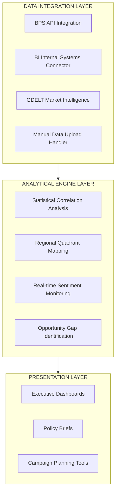

# QRIS Policy Optimization Framework

## Bank Indonesia DKSP ITSP Research Fellowship - Technical Assessment

### Strategic Objective

Develop a **production-ready analytical framework** that transforms Bank Indonesia's QRIS data into **actionable policy intelligence**. This framework demonstrates the technical architecture, analytical rigor, and scalability required for BI's national deployment.

### Framework Architecture



### Core Analytical Capabilities

1. **Economic-Digital Coupling Analysis**
* Pearson correlation with significance testing.
* Statistical power assessment and caveats.
* Quartile-based regional segmentation.


2. **Real-time Market Intelligence**
* Indonesian media sentiment monitoring.
* Risk detection across 5 strategic pillars.
* Automated alert system for emerging issues.


3. **Strategic Recommendation Engine**
* Data-driven campaign targeting.
* Resource allocation optimization.
* Implementation risk assessment.

## Technical Implementation Overview

This repository demonstrates an **analytical support framework** designed to assist policy assessment and program planning related to QRIS adoption.

The implementation emphasizes:

* **Clarity of methodology**
* **Reproducibility of analysis**
* **Compatibility with BI’s internal data workflows**

### Technology Stack (Demonstration Scope)

* **Language**: Python 3.9+
* **Core Libraries**: `pandas`, `numpy`, `scipy`, `requests`
* **Data Sources (Illustrative)**:

  * BPS public statistics
  * Media-based market intelligence (GDELT)
  * Simulated BI internal data structures
* **Outputs**:

  * Analytical summaries (JSON)
  * Input-ready data for dashboards and briefing materials

> *This repository focuses on analytical logic and structure rather than production deployment.*

---

## Analytical Outputs for Policy Support

The framework is designed to generate inputs commonly required by DKSP–ITSP teams, such as:

* Regional QRIS adoption mapping
* Identification of potential **priority intervention areas**
* Supporting data for internal presentations and policy briefs
* Early signals from media coverage related to payment system risks

All outputs are intended as **decision-support materials**, not automated policy recommendations.

---

## Demonstration & Validation Notes

> [!IMPORTANT]
> **Demonstration Scope Disclaimer**
>
> The current implementation uses **limited sample data** for demonstration purposes only.
> The value of this repository lies in:
>
> 1. **Analytical Structure** – Clear separation between data, analysis, and presentation layers
> 2. **Methodological Transparency** – Explicit assumptions and statistical caveats
> 3. **Scalability Concept** – Analytical logic remains consistent as data coverage expands
> 4. **Alignment with BI Workflow** – Designed to support, not replace, existing processes
>
> This repository should be reviewed as a **technical and analytical showcase**, not as a production system.


### Installation & Execution

```bash
# 1. Clone repository
git clone [repository-url]

# 2. Install dependencies
pip install -r requirements.txt

# 3. Configure environment
cp .env.example .env
# Edit .env and add your BPS_API_KEY

# 4. Run framework demonstration
python qris_policy_framework.py

# 5. View results
cat bi_qris_analysis_[timestamp].json

```


